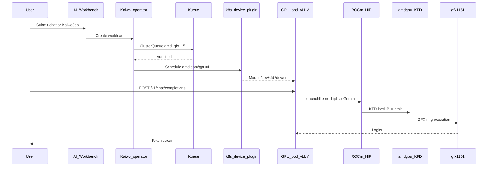
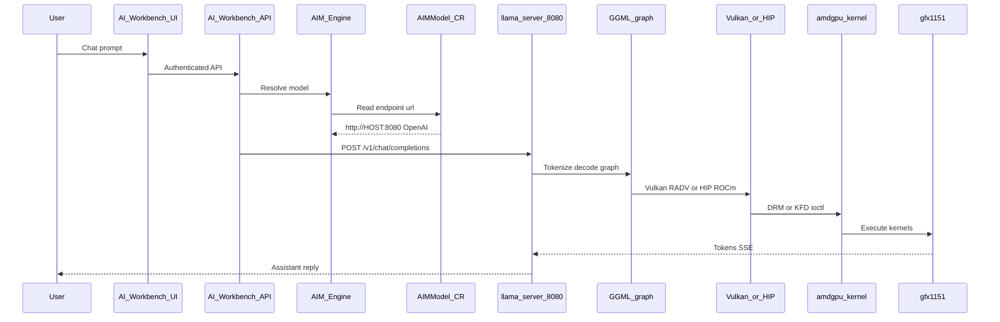

# End-to-end call flow: chat prompt → hardware → response

This document describes **two inference paths** on the Z13 gfx1151 stack:

1. **Standard EAI path** — ROCm HIP via Kaiwo + vLLM (cluster GPU pods)
2. **Local host path** — llama.cpp on the node (Vulkan for Gemma 4; HIP for SLMs after gfx1151 patches)

See also: [gfx1151-upstream-pr-guide.md](gfx1151-upstream-pr-guide.md) for source patches and upstream PR instructions.

## Standard path — ROCm HIP via Kaiwo + vLLM

## Local host path — llama.cpp (Workbench → AIMModel → host :8080)

## Path selection on gfx1151

| Scenario | Backend | Notes |
|----------|---------|-------|
| Cluster vLLM / PyTorch job | ROCm HIP | Standard EAI path; env vars in GPU plugin |
| Local Gemma 4 26B-A4B | **Vulkan** (default) | HIP MoE bug [#21416](https://github.com/ggml-org/llama.cpp/issues/21416); use `EAI_LLAMA_BACKEND=vulkan` |
| Local SLM (Qwen3-0.6B, phi-4-mini) | HIP (after patches) | Branch `gfx1151-rdna35-tuning`; `EAI_LLAMA_BACKEND=hip` |
| Local Gemma 4 after G1–G3 patches | HIP (test) | Re-test with unfused MoE path |

## Layer summary

| Layer | Component | Standard (HIP) | Local host |
|-------|-----------|----------------|------------|
| 7 UI | AI Workbench | Chat / job submit | Chat |
| 6 Control | AIM Engine + AIMModel | Optional routing | Endpoint CR → :8080 |
| 5 Orchestration | Kaiwo + Kueue | **Hot path** | Not used |
| 4 Platform | k3s, MetalLB, cert-manager | TLS, Services | Egress to host IP |
| 3 GPU | k8s-device-plugin | **Hot path** | Not used |
| 1 Inference | vLLM or llama-server | Pod HIP | Host Vulkan/HIP |
| 0 HW | gfx1151 + ROCm | KFD | DRM (Vulkan) or KFD (HIP) |

## Per-repository call-flow docs

| Doc | Component |
|-----|-----------|
| [00-prerequisites.md](call-flows/00-prerequisites.md) | Toolchain |
| [01-rocm-host.md](call-flows/01-rocm-host.md) | **ROCm substrate (standard path)** |
| [02-k3s.md](call-flows/02-k3s.md) | Kubernetes runtime |
| [03-k8s-device-plugin.md](call-flows/03-k8s-device-plugin.md) | GPU scheduling |
| [04-platform.md](call-flows/04-platform.md) | Platform Helm charts |
| [05a-cluster-forge.md](call-flows/05a-cluster-forge.md) | GitOps bootstrap |
| [05b-kaiwo.md](call-flows/05b-kaiwo.md) | **Standard inference orchestration** |
| [06a-aim-engine.md](call-flows/06a-aim-engine.md) | AIM Engine |
| [06b-airm-aiwb.md](call-flows/06b-airm-aiwb.md) | AIRM + AI Workbench |
| [07-llama-cpp.md](call-flows/07-llama-cpp.md) | Local inference hot path |

## Source trees

After build, read code under `~/eai-build/<repo>/`. Sync repos: `bash scripts/sync-eai-build.sh`.
