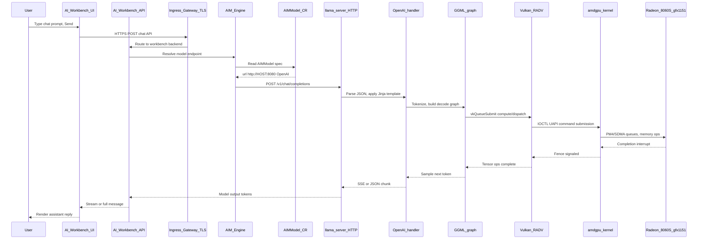

# End-to-end call flow: chat prompt → hardware → response

This document describes the **primary inference path** on this Z13 stack when Gemma 4 is served by **llama.cpp (Vulkan)** and registered in **AI Workbench** via an **AIMModel** CR. Alternative paths (Kaiwo → vLLM → HIP) are noted where they differ.

## Stack map (request direction ↓, response ↑)

## Layer summary

| Layer | Component | Request role | Response role |
|-------|-----------|--------------|---------------|
| 7 UI | AI Workbench | Captures prompt, auth (Keycloak) | Renders streamed text |
| 6 Control | AIM Engine + AIMModel CR | Maps logical model → HTTP endpoint | N/A (not on hot path for bytes) |
| 7 Inference | llama-server | OpenAI API, chat template | Token stream / JSON |
| 7 Compute | llama.cpp / GGML | Graph schedule, KV cache | Logits → tokens |
| 7 GPU API | Vulkan (Mesa RADV) | Command buffers, shaders | Sync, readback |
| 1 Kernel | `amdgpu` + DRM | Memory pinning, scheduling | IRQ → userspace |
| HW | gfx1151 unified memory | Execute WMMA/ALU ops | Updated VRAM/GTT |

## What is *not* on the Gemma-4-local hot path

These components are still installed and tested, but **a Workbench chat to the registered local endpoint does not traverse them per token**:

- **Kaiwo / Kueue** — used when scheduling Kubernetes `Pod`s with `amd.com/gpu`, not for host `llama-server`.
- **k8s-device-plugin** — exposes GPU to kubelet; host `llama-server` uses Vulkan directly.
- **cluster-forge / ArgoCD** — GitOps deploy only.
- **KServe / KubeRay** — alternative serving paths for cluster workloads.
- **ROCm HIP inside llama.cpp** — intentionally avoided for Gemma 4 on gfx1151 (see guide).

## Per-repository call-flow docs

| Doc | Repository / component |
|-----|------------------------|
| [00-prerequisites.md](call-flows/00-prerequisites.md) | Toolchain (not in inference path) |
| [01-rocm-host.md](call-flows/01-rocm-host.md) | ROCm / kernel memory |
| [02-k3s.md](call-flows/02-k3s.md) | Kubernetes runtime |
| [03-k8s-device-plugin.md](call-flows/03-k8s-device-plugin.md) | GPU device plugin |
| [04-platform.md](call-flows/04-platform.md) | cert-manager, MetalLB, Longhorn, … |
| [05a-cluster-forge.md](call-flows/05a-cluster-forge.md) | cluster-forge / GitOps |
| [05b-kaiwo.md](call-flows/05b-kaiwo.md) | Kaiwo orchestration |
| [06a-aim-engine.md](call-flows/06a-aim-engine.md) | AIM Engine operator |
| [06b-airm-aiwb.md](call-flows/06b-airm-aiwb.md) | AIRM + AI Workbench |
| [07-llama-cpp.md](call-flows/07-llama-cpp.md) | **Primary inference hot path** |

## Source trees

After a forced build, read code under `~/eai-build/<repo>/`. Scripts print the tree path after each clone/compile step.
