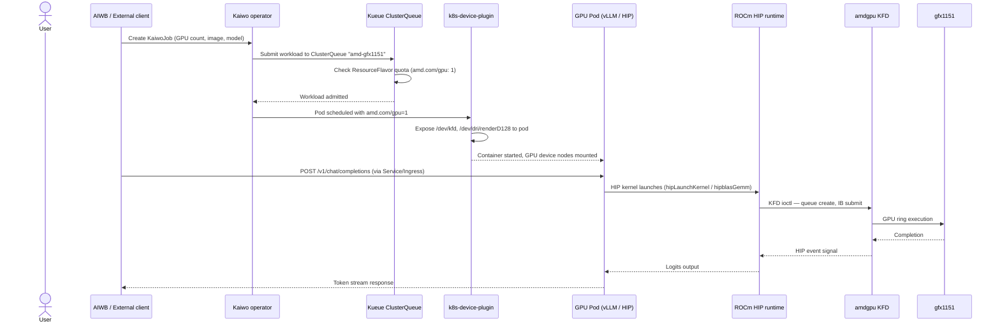
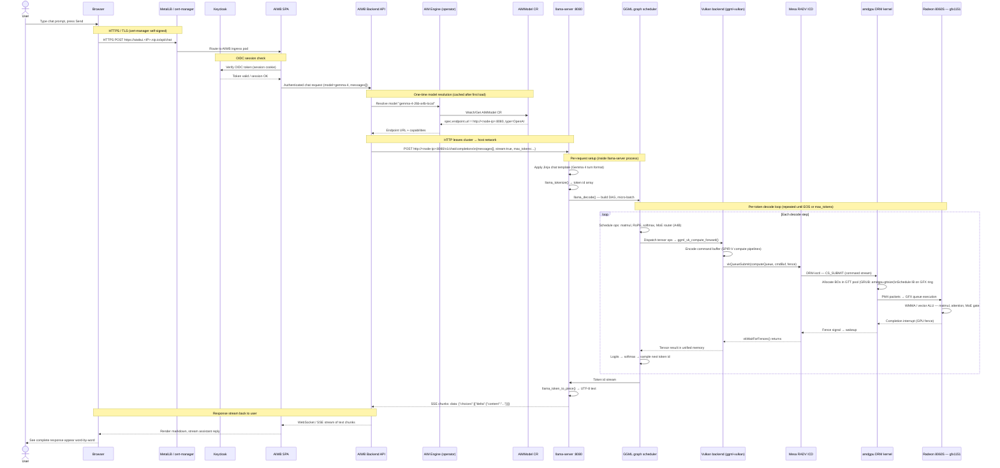

# AMD Enterprise AI Suite — Stack Overview

**Platform:** Asus Z13 · Radeon 8060S (gfx1151, RDNA 3.5) · 128 GB LPDDR5x · Ubuntu 24.04 LTS  
**Primary model:** Gemma 4 26B-A4B Q4\_K\_M (GGUF, ~14 GB quantised)  
**Standard inference:** ROCm HIP via Kaiwo + vLLM (cluster GPU pods)  
**Local host inference:** llama.cpp — Vulkan for Gemma 4 (HIP workaround); HIP for SLMs after gfx1151 patches  
**gfx1151 guide:** [docs/gfx1151-upstream-pr-guide.md](gfx1151-upstream-pr-guide.md)

This document covers:

1. [End-to-end call flow](#1-end-to-end-call-flow) — prompt → hardware → response, both primary and cluster paths
2. Per-repository chapters: [ROCm](#2-rocm) · [k3s](#3-k3s) · [k8s-device-plugin](#4-rocmk8s-device-plugin) · [Platform layer](#5-platform-layer) · [cluster-forge](#6-silogencluster-forge) · [Kaiwo](#7-silogenkaiwo) · [AIM Engine](#8-amd-enterprise-aiaim-engine) · [AIRM](#9-amd-resource-manager-airm) · [AI Workbench](#10-amd-ai-workbench-aiwb) · [llama.cpp](#11-ggml-orgllamacpp) · [Hardware](#12-hardware--amdgpu-kernel)

---

## 1. End-to-end call flow

### 1.1 Architecture layers

```
┌──────────────────────────────────────────────────────────────────────┐
│  Layer 7 — UI / Auth                                                 │
│  AMD AI Workbench (AIWB)  ·  AMD Resource Manager (AIRM)            │
│  Keycloak SSO  ·  cert-manager TLS  ·  MetalLB LoadBalancer         │
├──────────────────────────────────────────────────────────────────────┤
│  Layer 6 — Model control plane                                       │
│  AIM Engine operator  ·  AIMModel CR  ·  Gateway API routes         │
├──────────────────────────────────────────────────────────────────────┤
│  Layer 5 — Workload orchestration                                    │
│  Kaiwo operator  ·  Kueue ClusterQueue  ·  AppWrapper CRDs          │
│  cluster-forge / ArgoCD / Gitea  (deploy-time only)                 │
├──────────────────────────────────────────────────────────────────────┤
│  Layer 4 — Kubernetes platform                                       │
│  k3s API server  ·  Longhorn  ·  KubeRay  ·  KServe                 │
├──────────────────────────────────────────────────────────────────────┤
│  Layer 3 — GPU scheduling                                            │
│  ROCm k8s-device-plugin  →  amd.com/gpu kubelet resource            │
├──────────────────────────────────────────────────────────────────────┤
│  Layer 2 — Kubernetes node runtime                                   │
│  k3s kubelet  ·  containerd  ·  local registry :32000               │
├──────────────────────────────────────────────────────────────────────┤
│  Layer 1 — Host inference (local Workbench endpoint)                 │
│  llama-server (systemd)  ·  GGML  ·  Vulkan (Gemma) or HIP (SLM)   │
│  Mesa RADV or ROCm HIP → amdgpu                                      │
├──────────────────────────────────────────────────────────────────────┤
│  Layer 0 — Kernel + hardware                                         │
│  amdgpu DRM/KFD  ·  ROCm 7.2.3 userspace  ·  gfx1151 CUs           │
│  LPDDR5x unified memory (GTT / VRAM pool, GRUB-tuned)               │
└──────────────────────────────────────────────────────────────────────┘
```

### 1.2 Standard EAI call flow — ROCm HIP via Kaiwo + vLLM

This is the **canonical Enterprise AI suite path** for GPU inference in Kubernetes. ROCm HIP drives compute inside GPU pods scheduled by Kaiwo and Kueue.



### 1.3 Local host path — llama.cpp (Workbench → AIMModel → :8080)

Used when a model is registered via **AIMModel** pointing at host `llama-server`. This stack registers **Gemma 4** for AI Workbench chat.

> **gfx1151 note:** Gemma 4's MoE layer triggers a known HIP bug on gfx1151 ([#21416](https://github.com/ggml-org/llama.cpp/issues/21416)). **Vulkan** is the default backend for Gemma 4. **HIP** (branch `gfx1151-rdna35-tuning`) is used for SLMs and after upstream fixes. See [gfx1151-upstream-pr-guide.md](gfx1151-upstream-pr-guide.md).

This is the path followed for every token when a user chats with the registered **Gemma 4 26B-A4B (local)** model (Vulkan backend).



### 1.4 Components NOT on every token hot path

| Component | Role | When it acts |
|-----------|------|-------------|
| cluster-forge / ArgoCD | GitOps installer | Deploy time only |
| k8s-device-plugin | `amd.com/gpu` resource advertising | Kubelet scheduling (standard HIP path) |
| Longhorn | Persistent storage | Pod PVC I/O (not host GGUF file) |
| KServe / KubeRay | Alternative serving frameworks | Only if InferenceService deployed |
| ROCm HIP in host llama.cpp | GPU backend for local server | Standard for SLMs; Vulkan for Gemma 4 on gfx1151 |
| AIRM | GPU inventory / policies | Dashboard queries, not token path |
| MetalLB | LoadBalancer VIP | TCP connection setup only |

---

## 2. ROCm

**Repository / source:** AMD ROCm apt repository — `repo.radeon.com/rocm/apt/7.2.3`  
**Version installed:** 7.2.3  
**Script:** `scripts/01-host-rocm.sh`  
**Call-flow doc:** [`docs/call-flows/01-rocm-host.md`](call-flows/01-rocm-host.md)

### Quick summary

ROCm (Radeon Open Compute platform) is AMD's open-source GPU compute stack and the **standard GPU substrate for the Enterprise AI suite**. It provides HIP, rocBLAS, MIOpen, rocm-smi, and KFD. Cluster inference (Kaiwo → vLLM) uses ROCm HIP on every token. Host llama.cpp may use Vulkan (Gemma 4 on gfx1151) or HIP (SLMs and post-patch workloads). See [gfx1151-upstream-pr-guide.md](gfx1151-upstream-pr-guide.md) for gfx1151-specific fixes.

### Detailed explanation

**What is installed**

The `rocm` meta-package from `repo.radeon.com` pulls in:

| Package group | Contents |
|---------------|----------|
| `rocm-hip-runtime` | HIP runtime, libhsa-runtime, device libs |
| `rocm-dev` | hipcc, headers, rocBLAS, hipBLAS, rocFFT |
| `rocm-utils` | rocminfo, rocm-smi-lib, rocm-smi |
| `amdgpu-dkms` (in-tree for 6.x kernels) | `amdgpu` DRM/KFD module |

**Kernel driver — `amdgpu`**

The `amdgpu` kernel module provides two interfaces that the AI stack relies on:

- **DRM (Direct Rendering Manager):** Used by Mesa RADV (Vulkan ICD) for llama.cpp. Command submission goes through `amdgpu_cs_ioctl`, buffer objects are allocated in GTT or VRAM via TTM, and completion signals arrive as DRM fences.
- **KFD (Kernel Fusion Driver):** Used by ROCm HIP. HSA queues are allocated per-process; HIP kernels are submitted as Indirect Buffers (IB) through KFD. The Kaiwo/vLLM cluster path uses KFD from inside GPU pods.

**GRUB memory tuning**

The Radeon 8060S is an integrated GPU sharing system LPDDR5x. The kernel requires explicit hints to make the full 128 GB addressable:

```
amdgpu.gttsize=131072   # GTT pool ≈ 128 GiB (MiB units)
ttm.pages_limit=33554432 # TTM page limit (1 page = 4 KiB → 128 GiB)
amd_iommu=off            # Disable IOMMU passthrough conflict
```

Without these parameters `rocm-smi` reports only ~4 GiB VRAM. After a reboot with these parameters, the full unified memory pool is accessible, allowing the Gemma 4 weights (~14 GB) plus KV cache to reside in GPU-addressable memory.

**HSA override for gfx1151**

Strix Halo (gfx1151) is a relatively new RDNA 3.5 APU and some ROCm tools and containers default to detecting an older ISA. The override:

```bash
HSA_OVERRIDE_GFX_VERSION=11.5.1
```

is placed in `/etc/environment` so it applies globally, and also injected into Docker build contexts and pod environment variables to ensure ROCm tools inside containers report and compile for the correct ISA.

Additional performance environment variables set:

```bash
PYTORCH_TUNABLEOP_ENABLED=1          # Auto-tune GEMM kernels for this GPU
TORCH_ROCM_AOTRITON_ENABLE_EXPERIMENTAL=1  # AOTriton fused attention kernels
```

**Role in the call flow**

For the primary Vulkan path: ROCm userspace (HIP, HSA) is **not** invoked per token. The `amdgpu` kernel module is shared — both RADV and KFD access the same hardware through it. ROCm's contribution is:
1. Providing the kernel module that enables GPU access for all paths.
2. Making device plugin builds possible (the plugin links against ROCm headers).
3. Enabling the alternative HIP cluster path via KFD.

**Official documentation**

- [ROCm documentation hub](https://rocm.docs.amd.com/)
- [Install on Linux](https://rocm.docs.amd.com/projects/install-on-linux/en/latest/)
- [ROCm on Radeon/Ryzen APUs](https://rocm.docs.amd.com/projects/radeon-ryzen/en/latest/)
- [Environment variables reference](https://rocm.docs.amd.com/en/reference/env-variables.html)
- [amdgpu kernel docs](https://www.kernel.org/doc/html/latest/gpu/amdgpu/)

---

## 3. k3s

**Source:** `https://get.k3s.io` (or k3d fallback from `https://get.k3d.io`)  
**Version:** latest stable at install time (k3d v5.8.3 for fallback)  
**Script:** `scripts/02-kubernetes.sh`  
**Call-flow doc:** [`docs/call-flows/02-k3s.md`](call-flows/02-k3s.md)

### Quick summary

k3s is a CNCF-certified, lightweight Kubernetes distribution packaged as a single binary. It runs the full Kubernetes control plane (API server, scheduler, controller manager, etcd-backed by SQLite) plus a kubelet and kube-proxy in one process. On this single-node Z13 it is the base on which every operator, Helm release, and workload runs.

### Detailed explanation

**Why k3s over full Kubernetes**

A standard kubeadm cluster requires separate processes, external etcd, and additional configuration. k3s:
- Ships with containerd and Flannel CNI pre-integrated.
- Uses SQLite as the default datastore (sufficient for single node).
- Installs in one `curl | sh` command with a systemd unit.
- Supports `registries.yaml` for mirror configuration, eliminating Docker Hub rate limits.

**Local container registry**

`scripts/02-kubernetes.sh` deploys a `registry:2` container (Docker Distribution) as a Kubernetes Service on NodePort 32000. This registry stores locally-built images (GPU device plugin, kaiwo-operator) without requiring an external registry or Docker Hub credentials. `registries.yaml` tells k3s's containerd to mirror `localhost:32000` and `<node-ip>:32000` to itself:

```yaml
mirrors:
  "localhost:32000":
    endpoint: ["http://localhost:32000"]
  "<MY_IP>:32000":
    endpoint: ["http://<MY_IP>:32000"]
```

**k3d fallback**

When passwordless `sudo` is not available (CI environments, restricted machines), the script falls back to **k3d** — which runs k3s inside Docker containers. This provides the same Kubernetes API surface without requiring the host-level install.

**Swap and prerequisites**

k3s requires swap to be disabled (`swapoff -a`) and the kubelet requires `br_netfilter` and IP forwarding. The script handles all of these.

**Role in the call flow**

k3s is the runtime for every in-cluster component: AIWB, AIRM, AIM Engine, Keycloak, cert-manager, MetalLB, Kaiwo, and the GPU device plugin. The chat path enters the cluster through MetalLB's VIP, is routed by the k3s ingress, and the AIM Engine operator resolving the `AIMModel` CR runs as a k3s pod. The inference itself (llama-server) runs on the host as a systemd service and is outside k3s.

**Official documentation**

- [k3s documentation](https://docs.k3s.io/)
- [Installation guide](https://docs.k3s.io/installation)
- [Private registry configuration](https://docs.k3s.io/installation/private-registry)
- [k3d documentation](https://k3d.io/)

---

## 4. ROCm/k8s-device-plugin

**Repository:** [github.com/ROCm/k8s-device-plugin](https://github.com/ROCm/k8s-device-plugin)  
**Source location:** `~/eai-build/k8s-device-plugin/`  
**Image:** `localhost:32000/amd-gpu-device-plugin:latest`  
**Script:** `scripts/03-gpu-plugin.sh`  
**Call-flow doc:** [`docs/call-flows/03-k8s-device-plugin.md`](call-flows/03-k8s-device-plugin.md)

### Quick summary

The AMD GPU device plugin is a Kubernetes [Device Plugin](https://kubernetes.io/docs/concepts/extend-kubernetes/compute-storage-net/device-plugins/) that runs as a DaemonSet and registers AMD GPU hardware with the kubelet as the schedulable resource `amd.com/gpu`. Without it, Kubernetes has no awareness of GPUs — pods cannot request GPU allocation, and `amd.com/gpu` limits in pod specs are silently ignored.

### Detailed explanation

**How the Kubernetes Device Plugin API works**

The Device Plugin specification defines a gRPC protocol between a plugin and kubelet:

1. **Registration:** Plugin calls `kubelet.sock` → `Register()` with resource name `amd.com/gpu`.
2. **ListAndWatch:** Plugin streams available device IDs (`/dev/dri/card*`, `/dev/kfd`) to kubelet. Device health changes are streamed continuously.
3. **Allocate:** When a pod requests `amd.com/gpu: 1`, kubelet calls `Allocate()` on the plugin. The plugin returns the device nodes to mount into the pod (`/dev/kfd`, `/dev/dri/renderD128`) and environment variables (`HSA_OVERRIDE_GFX_VERSION=11.5.1`).

**DaemonSet configuration on gfx1151**

The plugin DaemonSet is applied with:

```yaml
env:
  - name: HSA_OVERRIDE_GFX_VERSION
    value: "11.5.1"
volumeMounts:
  - name: dev
    mountPath: /dev
  - name: sys
    mountPath: /sys
  - name: dp
    mountPath: /var/lib/kubelet/device-plugins
```

The `HSA_OVERRIDE_GFX_VERSION` override is injected into all allocated GPU pods automatically so HIP containers find the correct ISA without needing to set it themselves.

**Node labelling**

After plugin deployment, the node is labelled for Kaiwo topology-aware scheduling:

```bash
kubectl label node <node> kaiwo/worker=true
kubectl label node <node> kaiwo/gpu-model=gfx1151
```

These labels are used by Kaiwo's topology-aware scheduling (`TAS`) to match GPU jobs to compatible nodes.

**Role in the call flow**

Device plugin is **not** on the per-token hot path for the primary llama.cpp Vulkan inference. It is active when:
- Kaiwo submits GPU pod workloads (alternative inference path).
- The kubelet is scheduling any `amd.com/gpu`-requesting pod (integration tests, vLLM, etc.).

The host `llama-server` bypasses kubelet entirely — it opens `/dev/dri/renderD128` directly via Vulkan without going through the device plugin.

**Official documentation**

- [Repository README](https://github.com/ROCm/k8s-device-plugin/blob/master/README.md)
- [ROCm Kubernetes docs](https://rocm.docs.amd.com/projects/k8s-device-plugin/en/latest/)
- [Kubernetes Device Plugin API](https://kubernetes.io/docs/concepts/extend-kubernetes/compute-storage-net/device-plugins/)

---

## 5. Platform layer

**Script:** `scripts/04-platform.sh`  
**Call-flow doc:** [`docs/call-flows/04-platform.md`](call-flows/04-platform.md)

The platform layer is a set of independently deployed Helm charts that form the operational substrate for all higher-level AI services. None of these components is on the per-token inference path for local Gemma; they shape secure access, storage, and alternative serving capabilities.

### 5.1 cert-manager

**Helm repo:** `https://charts.jetstack.io`  
**Docs:** [cert-manager.io/docs](https://cert-manager.io/docs/)

cert-manager is a Kubernetes-native certificate controller. It watches `Certificate` and `Issuer` resources and provisions TLS secrets for ingress hostnames. On this stack it issues self-signed certificates for all public-facing UIs (`aiwbui.*`, `airmui.*`, `keycloak.*`, `gitea.*`). Without it, HTTPS would require manual certificate management.

### 5.2 MetalLB

**Helm repo:** `https://metallb.github.io/metallb` (v0.14.9)  
**Docs:** [metallb.io](https://metallb.io/)

MetalLB provides `LoadBalancer`-type Service support for bare-metal clusters that lack a cloud provider. It is configured with an `IPAddressPool` pinned to the node's primary IP and an `L2Advertisement` that ARP-announces the VIP. This makes AIWB and AIRM reachable by their domain names without needing an external load balancer.

### 5.3 Longhorn

**Helm repo:** `https://charts.longhorn.io`  
**Docs:** [longhorn.io/docs](https://longhorn.io/docs/)

Longhorn is a distributed block storage system for Kubernetes. It provides the default `StorageClass` so pods can claim Persistent Volumes for databases (PostgreSQL via CNPG), model artifact caches, and Keycloak state. It is installed only for host k3s (skipped for k3d where hostPath storage suffices).

### 5.4 Gateway API

**Manifest:** `https://github.com/kubernetes-sigs/gateway-api/releases/download/v1.3.0/standard-install.yaml`  
**Docs:** [gateway-api.sigs.k8s.io](https://gateway-api.sigs.k8s.io/)

Gateway API is the successor to Kubernetes Ingress. It provides `Gateway`, `HTTPRoute`, `GRPCRoute`, and related CRDs that enable expressive, role-oriented traffic routing. AIM Engine uses Gateway API classes to manage routing for in-cluster AIM-backed inference endpoints.

### 5.5 Kueue

**Manifest:** `https://github.com/kubernetes-sigs/kueue/releases/download/v0.17.0/manifests.yaml`  
**Docs:** [kueue.sigs.k8s.io](https://kueue.sigs.k8s.io/docs/overview/)

Kueue is a Kubernetes-native job-queuing system for batch and AI workloads. It operates at the level of `ResourceFlavors` and `ClusterQueues` to enforce GPU quotas, gang scheduling, and fair sharing. Configuration for this cluster:

```yaml
ResourceFlavor: amd-gfx1151
  nodeLabels:
    kaiwo/gpu-model: gfx1151
ClusterQueue: amd-gfx1151-queue
  resources:
    - amd.com/gpu: 1
    - cpu: 11
    - memory: 100Gi
```

Kaiwo integrates with Kueue to submit `AppWrapper`-wrapped pods through this queue.

### 5.6 KubeRay

**Helm repo:** `https://ray-project.github.io/kuberay-helm/`  
**Docs:** [ray-project.github.io/kuberay](https://ray-project.github.io/kuberay/)

KubeRay is the Kubernetes operator for [Ray](https://ray.io/), the distributed Python computing framework. It manages `RayCluster`, `RayJob`, and `RayService` CRDs. Kaiwo supports submitting `RayJob` workloads through KubeRay for distributed training and multi-node inference.

### 5.7 KServe

**Helm / manifest:** `https://github.com/kserve/kserve/releases/download/v0.15.0/kserve.yaml`  
**Docs:** [kserve.github.io/website](https://kserve.github.io/website/)

KServe is the CNCF standard for serving machine learning models on Kubernetes. It provides `InferenceService` CRDs with pre-built runtimes for Triton, TorchServe, HuggingFace TGI, vLLM, and others. On this stack it provides an alternative cluster-side inference path that is not used for the primary local Gemma endpoint.

---

## 6. silogen/cluster-forge

**Repository:** [github.com/silogen/cluster-forge](https://github.com/silogen/cluster-forge)  
**Source location:** `~/eai-build/cluster-forge/`  
**Script:** `scripts/05a-cluster-forge.sh`  
**Call-flow doc:** [`docs/call-flows/05a-cluster-forge.md`](call-flows/05a-cluster-forge.md)

### Quick summary

cluster-forge is a Go-based Kubernetes platform automation tool that deploys the AMD Enterprise AI Suite with full GitOps infrastructure. It bundles third-party Helm charts, community operators, and AMD-specific components into a single ArgoCD-managed stack using a bootstrap-first, app-of-apps deployment pattern. After bootstrap, it is not on any runtime inference path.

### Detailed explanation

**Architecture: bootstrap-first deployment**

cluster-forge uses a three-phase model to build a self-managing cluster:

```
Phase 1: Pre-cleanup
  └─ Detect and remove prior installations (idempotent)

Phase 2: GitOps foundation (manual Helm templates)
  ├─ ArgoCD v8.3.5      — GitOps controller
  └─ Gitea v12.3.0      — Self-hosted Git server

Phase 3: App-of-apps (ArgoCD-managed)
  ├─ OpenBao (secrets)
  ├─ Keycloak (SSO)
  ├─ MinIO (S3-compatible object storage)
  ├─ CNPG (CloudNative PostgreSQL)
  ├─ Kaiwo chart reference
  └─ AMD AIRM / AIWB (via ArgoCD Applications)
```

**CLI workflow: smelt → cast → bootstrap**

```bash
go run . smelt   # Read input/config.yaml → normalise charts into working/
go run . cast    # Package working/ into OCI artefact
./scripts/bootstrap.sh <domain> --cluster-size=small
```

`smelt` reads `input/config.yaml`, which lists component toggles (disable Keycloak, CNPG, MinIO for this Z13 single-node deployment). It normalises Helm values, Kustomize overlays, and raw YAML into a uniform `working/` directory.

`cast` packages the `working/` directory into an OCI artifact and pushes it to the cluster's local Gitea instance, making it available for ArgoCD to sync.

**app-of-apps pattern**

Once ArgoCD is installed, a root `Application` resource is created pointing to the cluster-forge Helm chart. ArgoCD recursively syncs all child `Application` resources (each corresponding to a component) in wave order from wave `-70` to `0`. This ordering ensures dependencies (cert-manager before ingress controllers, Keycloak before AIWB, etc.) are satisfied.

**This stack's configuration**

`scripts/05a-cluster-forge.sh` runs bootstrap with several components disabled:
- `--disabled-apps=airm,keycloak,cnpg,minio` — these are either deployed separately (AIRM via `06b-airm-workbench.sh`) or not needed for a minimal single-user Z13 setup.
- Domain passed as `$(domain)` = `<node-ip>.nip.io`.

**Role in the call flow**

cluster-forge is a **deploy-time only** component. Once `bootstrap.sh` completes:
- ArgoCD syncs and self-manages the app state.
- Gitea stores the GitOps repository.
- No cluster-forge process runs during inference.

**Official documentation**

- [cluster-forge repository](https://github.com/silogen/cluster-forge)
- [AMD Enterprise AI Suite install guide](https://enterprise-ai.docs.amd.com/en/latest/platform-infrastructure/on-premises-installation.html)
- [ArgoCD documentation](https://argo-cd.readthedocs.io/)

---

## 7. silogen/kaiwo

**Repository:** [github.com/silogen/kaiwo](https://github.com/silogen/kaiwo)  
**Source location:** `~/eai-build/kaiwo/`  
**Image:** `localhost:32000/kaiwo-operator:latest`  
**Script:** `scripts/05b-kaiwo.sh`  
**Call-flow doc:** [`docs/call-flows/05b-kaiwo.md`](call-flows/05b-kaiwo.md)

### Quick summary

Kaiwo (pronounced "ky-voh") is a Kubernetes-native AI workload orchestrator built on top of Ray and Kueue. It minimises GPU idle time through intelligent job queuing, topology-aware scheduling, fair sharing, and guaranteed quotas. It supports distributed training, fine-tuning, online inference, and batch inference on AMD GPUs. On this stack it is the operator for cluster-side GPU workloads (the alternative inference path); the primary Gemma path bypasses it.

### Detailed explanation

**Components**

Kaiwo has two main parts:

- **kaiwo-operator:** A Kubernetes controller that watches `KaiwoJob` and `KaiwoService` CRDs and manages the full lifecycle of workloads — from admission through scheduling to completion and cleanup.
- **kaiwo CLI:** A command-line tool (`kaiwo submit`, `kaiwo get`, `kaiwo logs`) for submitting and inspecting workloads from developer machines.

**Workload types**

| CRD | Backend | Use case |
|-----|---------|----------|
| `KaiwoJob` | Kubernetes Job or AppWrapper | Batch training, offline inference |
| `KaiwoJob` (Ray) | RayJob via KubeRay | Distributed multi-node training |
| `KaiwoService` | RayService | Online inference via Ray Serve |

**Scheduling pipeline**

```
KaiwoJob created
    │
    ▼
kaiwo-operator reconciler
    ├─ Check node labels: kaiwo/worker=true, kaiwo/gpu-model=gfx1151
    ├─ Build AppWrapper or RayJob with resource requests
    └─ Submit to Kueue ClusterQueue
           │
           ▼
    Kueue admission
    ├─ Check ResourceFlavor quota (amd.com/gpu)
    └─ Admit workload → activate pod
           │
           ▼
    kube-scheduler binds pod to node
           │
           ▼
    kubelet → k8s-device-plugin → Allocate()
           │
           ▼
    Pod starts with /dev/kfd, /dev/dri/renderD128 mounted
           │
           ▼
    vLLM / PyTorch / ROCm HIP runtime
```

**AppWrapper dependency**

Kaiwo wraps multi-pod workloads in `AppWrapper` CRDs (from `project-codeflare/appwrapper`) to provide gang scheduling guarantees — all pods in a distributed training job are admitted atomically, preventing partial allocation that would leave GPUs idle.

**Topology-aware scheduling (TAS)**

For multi-node workloads, Kaiwo reads topology labels on nodes to co-locate pods on the same rack or NVLink domain. On this single-node Z13 setup TAS is less relevant but the label infrastructure is in place.

**Build and deploy**

`scripts/05b-kaiwo.sh` builds the operator container image with `make docker-build`, pushes to `localhost:32000`, installs AppWrapper CRDs, then runs `make install deploy` with the local registry image. Kueue `ResourceFlavor` and `ClusterQueue` manifests are applied afterwards.

**Role in the call flow**

Kaiwo is **active** when a `KaiwoJob` or `KaiwoService` is submitted targeting a cluster GPU pod. It is **bypassed** for the primary llama.cpp host inference path. The integration tests in `tests/integration/test_kaiwo_operator.py` verify that the operator is running and CRDs are registered.

**Official documentation**

- [Kaiwo repository](https://github.com/silogen/kaiwo)
- [Kaiwo documentation](https://silogen.github.io/kaiwo/)
- [Kueue documentation](https://kueue.sigs.k8s.io/docs/overview/)
- [KubeRay documentation](https://ray-project.github.io/kuberay/)

---

## 8. amd-enterprise-ai/aim-engine

**Repository:** [github.com/amd-enterprise-ai/aim-engine](https://github.com/amd-enterprise-ai/aim-engine)  
**Source location:** `~/eai-build/aim-engine/`  
**Script:** `scripts/06a-aim-engine.sh`  
**Call-flow doc:** [`docs/call-flows/06a-aim-engine.md`](call-flows/06a-aim-engine.md)

### Quick summary

AIM Engine (AMD Inference Microservices Engine) is a Kubernetes operator that manages the lifecycle of AMD inference deployments through `AIMService` and `AIMModel` custom resources. It handles model discovery, runtime configuration selection, autoscaling via KEDA, and Gateway API routing. On this stack its most direct role is registering the host llama-server as an `AIMModel` endpoint, making it discoverable by AI Workbench.

### Detailed explanation

**Custom Resource types**

| CRD | Purpose |
|-----|---------|
| `AIMService` | Full managed inference deployment: selects runtime image, provisions pods, sets up scaling |
| `AIMModel` | Lightweight registration of an existing endpoint (URL + type) — used for external/host endpoints |
| `ClusterRuntimeConfig` | Cluster-wide routing policies and credential configuration |

**AIMService — full managed lifecycle**

For a managed deployment, AIM Engine:
1. Selects an optimal AIM container image (e.g., `amdenterpriseai/aim-qwen-qwen3-32b:0.8.5`) based on GPU availability and precision requirements.
2. Creates a Kubernetes `Deployment` with the runtime container, GPU resource requests, model source configuration (Hugging Face Hub or S3), and a PVC model cache.
3. Sets up a `Service` and optionally an `HTTPRoute` via Gateway API for routing to the inference endpoint.
4. Configures **KEDA** autoscaling on OpenTelemetry metrics (queue depth, token throughput) for demand-based scaling.

**AIMModel — external endpoint registration**

For the primary local Gemma path, `scripts/07-llama-cpp.sh` applies an `AIMModel` CR:

```yaml
apiVersion: aim.eai.amd.com/v1alpha1
kind: AIMModel
metadata:
  name: gemma-4-26b-a4b-local
spec:
  displayName: "Gemma 4 26B-A4B (local Q4_K_M)"
  endpoint:
    url: "http://<node-ip>:8080"
    type: OpenAI
  modelId: "gemma-4"
  capabilities: [chat, vision]
```

The AIM Engine operator:
- Validates the endpoint URL and type.
- Writes `status.conditions` (Ready) once the endpoint is reachable.
- Does **not** create any inference pods for an external endpoint — it is a registration only.
- Exposes the model in AIWB's model catalog.

**Controller internals**

Source reading order in `~/eai-build/aim-engine/`:

| Path | Purpose |
|------|---------|
| `api/` | Go type definitions for CRDs (AIMService, AIMModel, ClusterRuntimeConfig) |
| `internal/controller/` | controller-runtime reconcile loops |
| `dist/chart/templates/` | Helm templates: Deployment, RBAC, webhooks, CRDs |

The operator is built with [controller-runtime](https://github.com/kubernetes-sigs/controller-runtime) and follows the standard Kubernetes operator pattern: watch → reconcile → update status.

**Build artefacts**

```bash
make crds   # → dist/crds.yaml  (applied to cluster first)
make helm   # → dist/chart/     (installed with Helm)
```

**Role in the call flow**

AIM Engine is on the **model-resolution step** of the chat path — AIWB queries Kubernetes for the `AIMModel` CR to obtain the inference endpoint URL. Once the URL is resolved (cached by AIWB's informer), AIM Engine is not invoked per-token. It is most relevant when:
- A new model is registered or its endpoint changes.
- A managed `AIMService` deployment needs scaling or health management.
- Gateway API routing is configured for in-cluster endpoints.

**Official documentation**

- [AIM Engine repository](https://github.com/amd-enterprise-ai/aim-engine)
- [controller-runtime documentation](https://pkg.go.dev/sigs.k8s.io/controller-runtime)
- [KEDA documentation](https://keda.sh/)

---

## 9. AMD Resource Manager (AIRM)

**Helm chart:** `oci://docker.io/amdenterpriseai/charts/airm` (v1.0.2)  
**Script:** `scripts/06b-airm-workbench.sh`  
**Call-flow doc:** [`docs/call-flows/06b-airm-aiwb.md`](call-flows/06b-airm-aiwb.md)  
**UI:** `https://airmui.<IP>.nip.io`

### Quick summary

AMD Resource Manager (AIRM) is the GPU and compute resource management UI for the AMD Enterprise AI Suite. It provides dashboards for GPU inventory, health monitoring, utilisation metrics, and policy management across nodes and namespaces. It is not on the per-token inference hot path but provides the operational visibility layer above the GPU stack.

### Detailed explanation

**What AIRM provides**

AIRM is deployed as a pre-built Helm OCI chart (application source is not public). Based on the architecture and CRD interactions:

| Feature | Description |
|---------|-------------|
| GPU inventory | Discovers `amd.com/gpu` resources across nodes via k8s-device-plugin; displays GPU model, memory, utilisation |
| Health monitoring | Polls `rocm-smi` metrics from GPU nodes; surfaces temperature, power draw, error counts |
| Policy management | Integration with Kueue `ClusterQueue` and `ResourceFlavor` for quota policies |
| Namespace usage | Per-namespace GPU allocation tracking for multi-tenant environments |
| AIM Engine integration | Reads `AIMModel` / `AIMService` status for inference endpoint health |

**Deployment**

```bash
helm install airm \
  oci://docker.io/amdenterpriseai/charts/airm \
  --version 1.0.2 \
  --namespace airm \
  --set global.domain="<ip>.nip.io" \
  --set global.certOption=generate
```

The chart uses cert-manager to generate TLS certificates for `airmui.<domain>` and registers Keycloak as the OIDC identity provider (same realm as AIWB).

**Keycloak integration**

AIRM and AIWB share the same Keycloak realm. Users authenticated in one UI are recognised in the other through OIDC session cookies. This enables seamless navigation between the model chat interface (AIWB) and the resource management dashboard (AIRM).

**Role in the call flow**

AIRM is **not** on the per-token hot path for local Gemma inference. It may perform background queries to:
- Check GPU capacity before the workbench surfaces a model (quota check).
- Display live GPU utilisation as llama.cpp runs.

For the primary path, AIRM is a parallel observability system rather than a gating component.

**Documentation**

- AIRM is part of the AMD Enterprise AI Suite; see [enterprise-ai.docs.amd.com](https://enterprise-ai.docs.amd.com/)

---

## 10. AMD AI Workbench (AIWB)

**Helm chart:** `oci://docker.io/amdenterpriseai/charts/aiwb` (v1.0.3)  
**Script:** `scripts/06b-airm-workbench.sh`  
**Call-flow doc:** [`docs/call-flows/06b-airm-aiwb.md`](call-flows/06b-airm-aiwb.md)  
**E2E tests:** `tests/e2e/test_aiwb_ui.py`  
**UI:** `https://aiwbui.<IP>.nip.io`

### Quick summary

AMD AI Workbench (AIWB) is the user-facing chat and model management application in the AMD Enterprise AI Suite. It is the **top of the call stack** — the first service to receive a user's prompt and the last to display the response. It provides a model catalog powered by `AIMModel` CRDs, a chat interface with streaming responses, Hugging Face Hub integration for model discovery, and Keycloak-secured multi-user authentication.

### Detailed explanation

**Architecture overview**

AIWB is deployed as a Helm chart containing:
- **Single Page Application (SPA):** React-based chat UI served from an nginx ingress.
- **Backend API:** REST/GraphQL service that mediates between the SPA and inference endpoints.
- **Keycloak integration:** OIDC client configured in the shared Keycloak realm; all API calls carry OIDC tokens.
- **Kubernetes informer:** Watches `AIMModel` CRDs to populate the model catalog and resolve endpoint URLs.

**Request lifecycle**

1. **User opens** `https://aiwbui.<domain>` — TLS terminated by cert-manager ingress.
2. **Keycloak SSO:** Unauthenticated requests redirect to `https://keycloak.<domain>/auth`. User logs in as `silogen-admin` (created by cluster-forge bootstrap).
3. **Model catalog:** SPA fetches the model list from AIWB backend, which lists all `AIMModel` CRs in the aim-system namespace.
4. **User selects** "Gemma 4 26B-A4B (local)" — backend resolves this to `AIMModel` CR `gemma-4-26b-a4b-local`.
5. **Prompt sent:** SPA POSTs to AIWB backend with `{model: "gemma-4", messages: [...]}`.
6. **Endpoint resolution:** Backend (or an AIM Engine sidecar) reads `spec.endpoint.url = http://<node-ip>:8080` from the CR.
7. **Forwarded:** Backend makes HTTP POST to `llama-server` with OpenAI-compatible JSON.
8. **Streaming:** llama-server returns Server-Sent Events (SSE); AIWB backend streams chunks back to the SPA via WebSocket or SSE.
9. **Rendered:** SPA renders markdown, code blocks, and streaming text.

**Hugging Face integration**

`HF_TOKEN` (required env variable) is passed to the AIWB chart at install time. This enables:
- Model discovery from Hugging Face Hub in the catalog UI.
- Automatic model card display for registered models.
- Potential future GGUF downloads from Hub.

**Multi-model support**

AIWB can display and route to multiple `AIMModel` CRs simultaneously. A user can switch between a local Gemma endpoint and a cluster-side vLLM endpoint (if deployed) from the same chat interface. The routing is purely HTTP — each model has a distinct endpoint URL.

**Deployment**

```bash
helm install aiwb \
  oci://docker.io/amdenterpriseai/charts/aiwb \
  --version 1.0.3 \
  --namespace aiwb \
  --set global.domain="<ip>.nip.io" \
  --set global.certOption=generate \
  --set keycloak.externalUrl="https://keycloak.<ip>.nip.io" \
  --set huggingface.token="$HF_TOKEN"
```

**Role in the call flow**

AIWB is the **entry point** and **exit point** of every user interaction. It is the only component that renders text to the user. It is involved in:
- Authentication (Keycloak redirect).
- Model selection and endpoint resolution (AIMModel CR read).
- HTTP forwarding to llama-server.
- Response streaming to the browser.

**Documentation**

- AIWB is part of the AMD Enterprise AI Suite; see [enterprise-ai.docs.amd.com](https://enterprise-ai.docs.amd.com/)

---

## 11. ggml-org/llama.cpp

**Repository:** [github.com/ggml-org/llama.cpp](https://github.com/ggml-org/llama.cpp)  
**Source location:** `~/eai-build/llama.cpp/`  
**Build:** CMake with `-DGGML_VULKAN=ON`, llama-server binary  
**Runtime:** systemd user service `llama-gemma.service` on port 8080  
**Script:** `scripts/07-llama-cpp.sh`  
**Call-flow doc:** [`docs/call-flows/07-llama-cpp.md`](call-flows/07-llama-cpp.md)

### Quick summary

llama.cpp is a high-performance C/C++ LLM inference library by Georgi Gerganov (ggml-org). It implements a wide range of transformer architectures in GGUF format, with compute backends for CPU, CUDA, Metal, Vulkan, HIP, SYCL, and others. On this stack it is **the primary inference engine** — every token for the Gemma 4 model is produced by llama.cpp using the Vulkan backend (Mesa RADV), running as a long-lived systemd service exposing an OpenAI-compatible HTTP API on port 8080.

### Detailed explanation

**Why llama.cpp and why Vulkan**

llama.cpp was chosen for this stack because:
- It is the fastest path to running a quantised GGUF model on consumer hardware with minimal dependencies.
- The Vulkan backend supports unified memory architectures well — weight buffers and KV cache are allocated in GPU-visible GTT memory without explicit CPU↔GPU copies.
- **Critical:** The ROCm HIP backend in llama.cpp triggers an infinite decode loop on gfx1151 with Gemma 4's MoE router (tracked in [issue #21416](https://github.com/ggml-org/llama.cpp/issues/21416)). Vulkan is the only validated backend for this hardware+model pair.

**Build**

```bash
cmake -B build \
  -DGGML_VULKAN=ON \
  -DCMAKE_BUILD_TYPE=Release \
  -G Ninja

cmake --build build --target llama-server -j$(nproc)
```

The Vulkan shaders are compiled at CMake time from GLSL/HLSL sources in `ggml/src/ggml-vulkan/ggml-vulkan-shaders/` into SPIR-V bytecode embedded in the binary.

**systemd service**

`scripts/07-llama-cpp.sh` installs a user systemd unit at `~/.config/systemd/user/llama-gemma.service`:

```ini
[Service]
ExecStart=<build>/bin/llama-server \
  --model $HOME/models/gemma-4-26b-a4b-it-Q4_K_M.gguf \
  --host 0.0.0.0 \
  --port 8080 \
  --n-gpu-layers 999 \
  --ctx-size 32768 \
  --jinja
Restart=on-failure
```

`--n-gpu-layers 999` offloads all layers to the Vulkan GPU backend. `--ctx-size 32768` sets the KV cache window. `--jinja` enables the Jinja2 chat template engine for proper Gemma 4 turn formatting.

**Token generation pipeline — detailed**

```
POST /v1/chat/completions
        │
        ▼ tools/server/server.cpp
  Parse JSON body
  Apply Jinja chat template (Gemma 4: <start_of_turn>user\n...<end_of_turn>)
  llama_tokenize() → token[] (BPE/SentencePiece vocab from GGUF)
        │
        ▼ src/llama-context.cpp
  Manage KV cache (slot allocation, rolling window)
  Build micro-batch for this decode step
        │
        ▼ src/llama-graph.cpp + ggml/src/ggml.c
  Build computation DAG:
    ├─ Token embedding lookup
    ├─ For each transformer layer:
    │    ├─ RMSNorm
    │    ├─ Q/K/V projections (matmul)
    │    ├─ RoPE (rotary position encoding)
    │    ├─ Grouped-query attention (GQA) + softmax
    │    ├─ FFN: MoE router (top-4 of 8 experts for Gemma 4-A4B)
    │    └─ Expert matmuls (gate + up + down projections)
    └─ Final RMSNorm → lm_head projection → logits
  Backend scheduler assigns tensors → GGML_BACKEND_VULKAN
        │
        ▼ ggml/src/ggml-vulkan/ggml-vulkan.cpp
  Encode compute command buffers (SPIR-V pipelines per op type)
  vkQueueSubmit(computeQueue, cmdBuf[])
        │
        ▼ Mesa RADV (libvulkan_radeon.so)
  Translate Vulkan commands → DRM ioctl
  vkWaitForFences() blocks until GPU signals completion
        │
        ▼ amdgpu DRM (kernel)
  Allocate/pin buffer objects in GTT pool
  Submit IBs to GFX ring
  Raise completion interrupt
        │
        ▼ Radeon 8060S — gfx1151
  Execute WMMA/vector ALU for matmul
  MoE expert routing in shader
  Unified LPDDR5x for weights + KV cache
        │
        ▲ (return path)
  Completion interrupt → DRM fence
  RADV fence → Vulkan fence signalled
  ggml: tensor results in mapped memory
  llama.cpp: logits → temperature / top-p sampler → next token id
  Detokenize → UTF-8 piece
  SSE chunk: data: {"choices":[{"delta":{"content":"<piece>"}}]}
        │
        ▼ HTTP response
  AIWB backend aggregates SSE
  SPA streams to browser
  User reads response
```

**Key source files**

| File | Role |
|------|------|
| `tools/server/server.cpp` | HTTP server, request routing, SSE streaming |
| `tools/server/server-chat.cpp` | Chat completion handler, Jinja template |
| `tools/server/server-context.cpp` | Context/slot lifecycle management |
| `src/llama-context.cpp` | KV cache, batch, decode loop |
| `src/llama-graph.cpp` | Transformer graph construction (all architectures) |
| `ggml/src/ggml-vulkan/ggml-vulkan.cpp` | Vulkan backend: device init, op dispatch, memory |
| `ggml/src/ggml-vulkan/ggml-vulkan-shaders/` | GLSL compute shaders compiled to SPIR-V |
| `src/llama-sampling.cpp` | Logit sampling (greedy, top-k, top-p, temperature) |
| `src/llama-vocab.cpp` | BPE/SentencePiece tokeniser (read from GGUF) |

**GGUF model format**

The model file `gemma-4-26b-a4b-it-Q4_K_M.gguf` is a self-contained binary format that encodes:
- All tensor data (weights) in Q4\_K\_M quantization (~4 bits/weight with mixed precision for key layers).
- Tokeniser vocabulary and merge rules.
- Model hyperparameters (layer count, heads, context length, MoE expert count).
- The Jinja chat template for this model variant.

Q4\_K\_M reduces Gemma 4's ~48 GB fp16 weight footprint to ~14 GB, making it feasible to run entirely in the gfx1151's unified memory pool.

**Official documentation**

- [llama.cpp repository](https://github.com/ggml-org/llama.cpp)
- [Build documentation](https://github.com/ggml-org/llama.cpp/blob/master/docs/build.md)
- [llama-server README](https://github.com/ggml-org/llama.cpp/blob/master/tools/server/README.md)
- [Vulkan backend build](https://github.com/ggml-org/llama.cpp/blob/master/docs/build.md#vulkan)
- [GGUF specification](https://github.com/ggml-org/ggml/blob/master/docs/gguf.md)

---

## 12. Hardware & amdgpu kernel

**Hardware:** Asus Z13, Radeon 8060S (gfx1151, RDNA 3.5), 128 GB LPDDR5x unified memory  
**Kernel driver:** `amdgpu` (in-tree, Linux 6.x)  
**Vulkan ICD:** Mesa RADV (`libvulkan_radeon.so`)

### Quick summary

The Radeon 8060S is an integrated GPU (iGPU) on AMD's Strix Halo SoC. It shares LPDDR5x memory with the CPU — there is no discrete VRAM. This unified memory architecture requires GRUB-level pool configuration to expose the full 128 GB to GPU workloads. The `amdgpu` kernel module provides both the DRM interface (used by Mesa RADV / Vulkan) and the KFD interface (used by ROCm HIP). At the hardware level, gfx1151 executes WMMA/vector ALU shader instructions for the matmul and attention operations at the core of LLM inference.

### Detailed explanation

**GPU specifications (Radeon 8060S, gfx1151)**

| Property | Value |
|----------|-------|
| Architecture | RDNA 3.5 (Strix Halo) |
| GFX ISA | gfx1151 |
| Compute units | 40 CUs |
| Shader processors | 2560 shaders |
| Memory type | Unified LPDDR5x (shared with CPU) |
| Memory bandwidth | ~256 GB/s |
| Vulkan | Supported via Mesa RADV |
| ROCm HIP | Supported via KFD (HSA\_OVERRIDE\_GFX\_VERSION=11.5.1) |

**Unified memory architecture**

Unlike discrete GPUs with dedicated GDDR/HBM, the 8060S uses system LPDDR5x. This means:
- No PCIe transfer bottleneck: CPU and GPU share the same physical memory.
- Memory allocation competes with OS/applications — hence the GRUB tuning.
- GTT (Graphics Translation Table) pool is carved from system RAM: after `amdgpu.gttsize=131072`, approximately 128 GiB is mapped into GTT, fully accessible to GPU shaders.
- The Gemma 4 Q4\_K\_M model (~14 GB) plus KV cache fit comfortably in the unified pool.

**amdgpu kernel module**

The `amdgpu` module provides two distinct kernel interfaces:

**DRM path (Vulkan / Mesa RADV):**
```
vkQueueSubmit()
    → RADV userspace driver (libvulkan_radeon.so)
    → DRM ioctl: DRM_IOCTL_AMDGPU_CS (command submission)
    → amdgpu_cs_ioctl() in kernel
    → TTM buffer object allocation (amdgpu_gem_object_create)
    → IB (Indirect Buffer) queued to GFX ring scheduler
    → amdgpu_ring_commit() → hardware GFX queue
    → GPU executes PM4 packet stream
    → amdgpu_fence_emit() → completion interrupt
    → DRM fence signalled → wakeup
```

**KFD path (ROCm HIP):**
```
hipLaunchKernel() / hipblasGemm()
    → ROCclr / HIP runtime
    → HSA Queue Submit
    → amdkfd_ioctl_submit_memory() in kernel
    → HSA packet processor queue
    → GPU executes dispatch
    → HSA completion signal
```

Both paths share the same physical hardware — the `amdgpu` module arbitrates access through its scheduler and command rings.

**RDNA 3.5 shader execution (gfx1151)**

At the hardware level, a single llama.cpp decode step produces:
- Hundreds of WMMA (Wave Matrix Multiply Accumulate) instructions for the Q/K/V projections and FFN matmuls.
- Vector ALU instructions for RoPE, RMSNorm, softmax.
- Indirect branches for MoE router top-k selection (4 of 8 experts).
- Scatter/gather loads for quantised weight tiles (Q4\_K\_M dequantization in shader).

The 40 CUs execute these in parallel across the token dimension and batch dimension, with the unified LPDDR5x providing weight data at ~256 GB/s bandwidth.

**Mesa RADV (Vulkan ICD)**

Mesa's RADV is the open-source Vulkan driver for AMD GPUs. For llama.cpp:
- SPIR-V compute shaders compiled from `ggml-vulkan-shaders/` are translated by RADV's LLVM backend into GFX ISA.
- Memory is allocated as Vulkan `VkBuffer` objects backed by host-visible device-local memory (unified memory, no staging needed).
- Cooperative matrices (Vulkan extension `VK_KHR_cooperative_matrix`) may be used on supported paths for accelerated WMMA.

**GRUB tuning verification**

After applying the GRUB parameters and rebooting:

```bash
rocm-smi --showmeminfo vram   # Should report ~128 GiB, not ~4 GiB
rocminfo | grep gfx            # Should show gfx1151
```

If VRAM still shows ~4 GiB, the GTT pool was not enlarged — see `scripts/01-host-rocm.sh` and the `EAI_GRUB_APPLY_GUIDE_VALUES=1` flag.

**Documentation**

- [AMD GPU architecture documentation](https://gpuopen.com/amd-rdna-architecture/)
- [Mesa RADV documentation](https://docs.mesa3d.org/drivers/radv.html)
- [Linux amdgpu kernel documentation](https://www.kernel.org/doc/html/latest/gpu/amdgpu/)
- [ROCm gfx1151 support](https://rocm.docs.amd.com/projects/radeon-ryzen/en/latest/)

---

## Appendix: Component dependency map

```
User prompt
    │
    ▼
[AIWB] ──auth──► [Keycloak] ──cert──► [cert-manager]
    │                                       │
    │ model lookup                          │ TLS
    ▼                                       ▼
[AIM Engine] ──reads──► [AIMModel CR]   [MetalLB] ──VIP──► [k3s ingress]
    │
    │ endpoint URL
    ▼
[llama-server :8080] ──systemd, no k8s──► host process
    │
    ▼
[GGML graph] ──dispatch──► [Vulkan backend / ggml-vulkan]
    │
    ▼
[Mesa RADV] ──ioctl──► [amdgpu DRM] ──ring──► [gfx1151 HW]
    │                       │
    │                       └──KFD──► [ROCm HIP] (alternative/cluster path)
    │                                     │
    │                                 [Kaiwo] ──Kueue──► [k8s-device-plugin]
    │                                     │
    │                                 [GPU pod: vLLM]
    ▼
response token
    │
    ▼
[llama-server SSE] ──► [AIWB backend] ──► [AIWB SPA] ──► User
```

## Appendix: Quick reference — ports, URLs, and credentials

| Service | URL | Default credentials |
|---------|-----|---------------------|
| AI Workbench | `https://aiwbui.<IP>.nip.io` | Keycloak `silogen-admin` |
| AIRM | `https://airmui.<IP>.nip.io` | Keycloak `silogen-admin` |
| Keycloak | `https://keycloak.<IP>.nip.io` | set at bootstrap |
| Gitea | `https://gitea.<IP>.nip.io` | set at bootstrap |
| ArgoCD | `kubectl port-forward svc/argocd-server -n argocd 8443:443` | |
| llama-server | `http://<node-IP>:8080` | no auth (host-only) |
| Local registry | `http://localhost:32000` | no auth |

## Appendix: Script execution order

```bash
bash scripts/lib/disk-report.sh baseline --baseline   # disk snapshot
bash scripts/00-prerequisites.sh    # Go, Helm, kubectl, Python venv
bash scripts/01-host-rocm.sh        # ROCm, GRUB  ← may require reboot
bash scripts/02-kubernetes.sh       # k3s + local registry
bash scripts/03-gpu-plugin.sh       # AMD GPU device plugin DaemonSet
bash scripts/04-platform.sh         # cert-manager, MetalLB, Longhorn, …
bash scripts/05a-cluster-forge.sh   # ArgoCD, Gitea, Keycloak, GitOps
bash scripts/05b-kaiwo.sh           # Kaiwo operator + Kueue queues
bash scripts/06a-aim-engine.sh      # AIM Engine operator + CRDs
HF_TOKEN=... bash scripts/06b-airm-workbench.sh  # AIRM + AIWB
bash scripts/07-llama-cpp.sh        # llama-server + AIMModel CR
```
