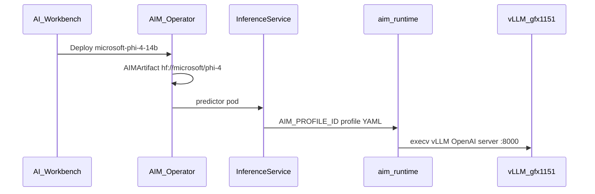

# Call flow: Phi-4 14B managed AIM (gfx1151)

**Script:** `scripts/13-phi-4-14b.sh`  
**Post-install:** [PHI4_14B_AIM_BLOOM_POST_INSTALL.md](../PHI4_14B_AIM_BLOOM_POST_INSTALL.md)

## Preconditions

1. Bloom cluster healthy; AIM Engine CRDs installed.
2. **DiffusionGemma paused** — `bash scripts/ensure-diffusiongemma-paused.sh` (single GPU).
3. Catalog CRs applied: `CATALOG_ONLY=1 bash scripts/13-phi-4-14b.sh`.

## Deploy path



## Request paths

| Consumer | Endpoint |
|----------|----------|
| Workbench Chat | HTTPRoute → predictor `:8000/v1/chat/completions` |
| In-cluster tests | `phi-4-llm.default.svc.cluster.local/v1` (bridge Endpoints) |
| Telecom agent (optional) | `llm.existingService` → `phi-4-llm` bridge |

## Post-deploy fixes

Always run after Workbench Deploy:

```bash
bash scripts/ensure-phi-4-14b-profile-mount.sh demo
bash scripts/fix-aim-httproute-gateway.sh demo
bash scripts/ensure-phi-4-14b-chattable.sh
bash scripts/ensure-phi-4-llm-bridge.sh
```

## Tool calling

Profile enables `enable-auto-tool-choice` + `tool-call-parser: phi4_mini_json` (experimental on 14B). Validate with `bash scripts/ensure-phi-4-tool-calling.sh demo` before pointing telecom at Phi-4.
